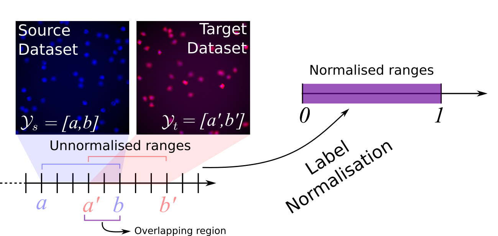

# Semi-supervised-Domain-Adaptation-for-Holistic-Counting-under-Label-Gap

This paper proposes a novel approach for semi-supervised domain adaptation for holistic regression tasks, where a DNN predicts a continuous value y given an input image x. The current literature generally lacks specific domain adaptation approaches for this task, as most of them mostly focus on classification. In the context of holistic regression, most of the real-world datasets not only exhibit a covariate (or domain) shift, but also label gap -- the target dataset may contain labels not included in the source dataset (and vice versa). We propose an approach tackling both covariate and label gap in a unified training framework. Specifically, we use a Generative Adversarial Network (GAN) to reduce covariate shift and we normalise the training labels to mitigate label gap. To avoid overfitting, we propose a stopping criterion that simultaneously takes advantage of the Maximum Mean Discrepancy and the GAN Global Optimality condition.
To restore the original label range -- that was previously normalised,-- we use a handful of annotated images from the target domain. Our experimental results, run on 3 different datasets, demonstrate that our approach drastically outperforms the state-of-the-art across the board. Specifically, for the cell counting problem, the MSE is reduced from 759 to 5.62; in the case of the pedestrian dataset, our approach lowered the MSE from 131 to 1.47. For the last experimental setup, we borrowed a task from plant biology, i.e. counting the number of leaves in a plant, and we run two series of experiments, showing the MSE is reduced from 2.36 to 0.88 (intra-species), and from 1.48 to 0.6 (inter-species).
